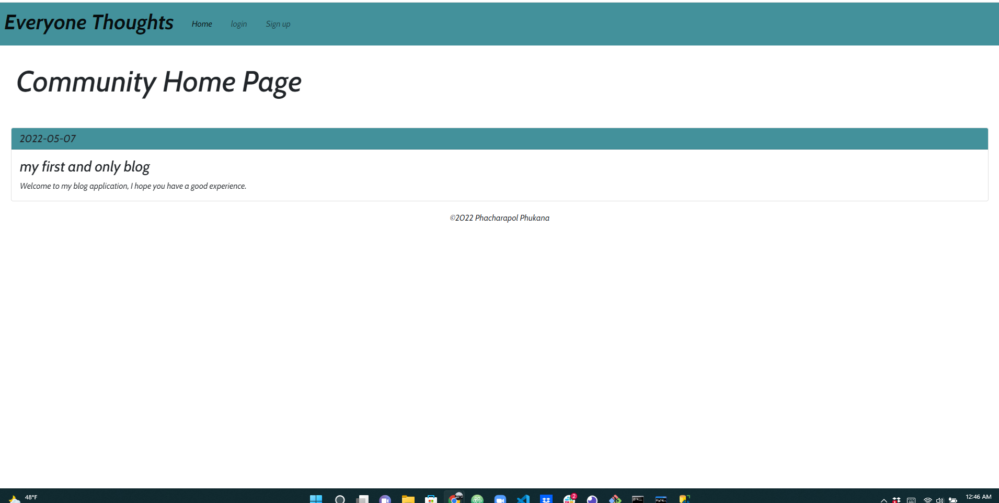
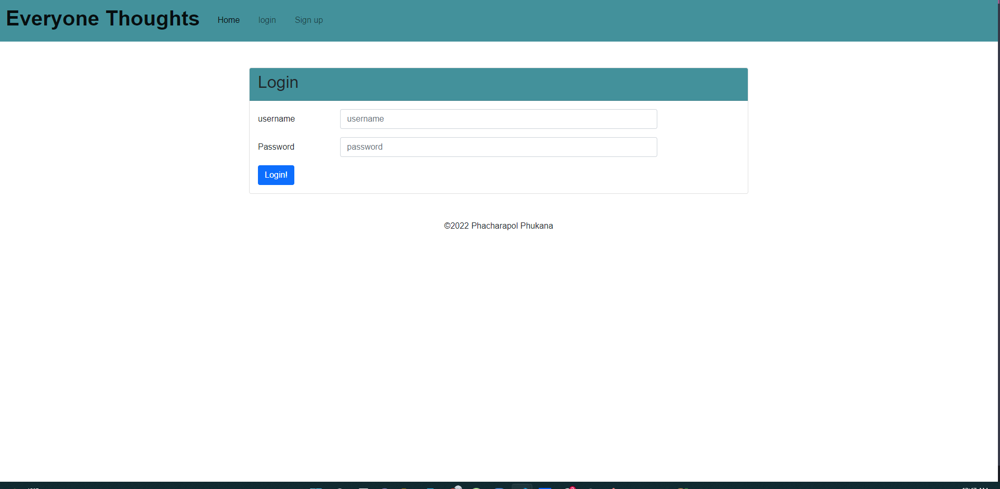
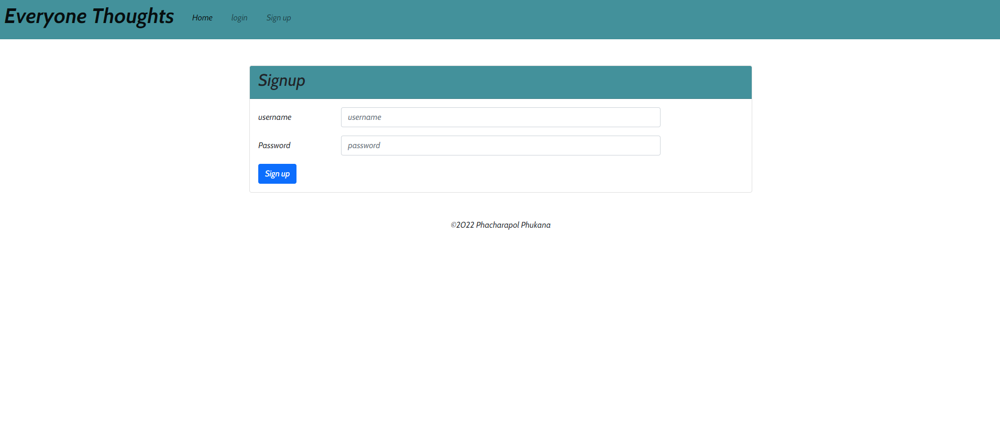
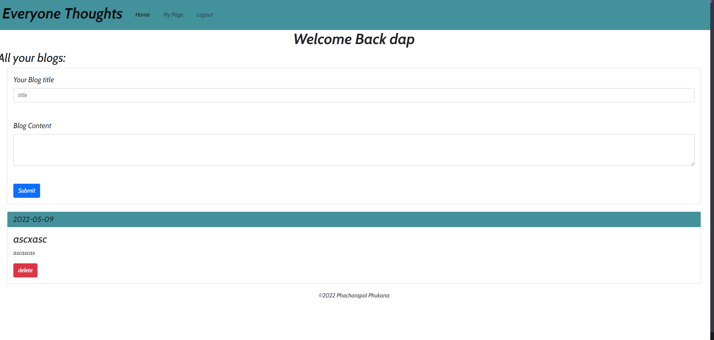

# My Blog  

    
    User will be able to create login account to write their own thought and share with the public. User can delete their own on their profile. no one can access other user blog and delete their blogs.

## Table Contents

  - [Installation](#installation)
  - [Usage](#usage)
  - [Contributing](#contributing)
  - [Test](#test)
  - [Question](#question)
   

## Installation
    clone this repository. 
    installed npm i to yur terminal
    create .env file and in put your sql password

## Usage
    Javascript
    SQL
    Node.js
    npm
    handlebars.js
    heroku
    css
   

## Contributing
    Anyone can help improve this app. Please contact me below

## Demo

## Question
- [phacharapol18](https://github.com/phacharapol18)
- <a href = "mailto:phacharapol18@gmail.com" target = "_blank">phacharapol18@gmail.com</a>
### Thank you
    